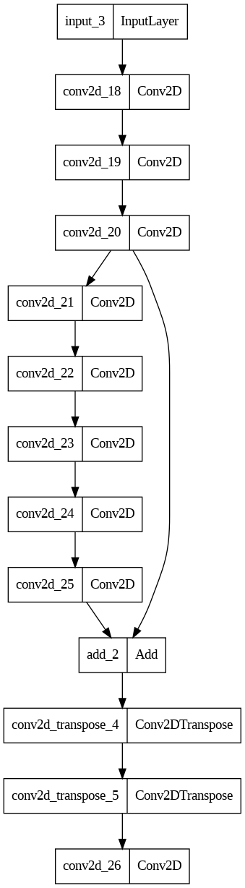

# AutoR-Encoder-DeepSea-Image-Enhancement
Enhances underwater images using a model built based on auto encoder architecture.

Dataset: https://drive.google.com/drive/folders/1ZEql33CajGfHHzPe1vFxUFCMcP0YbZb3?usp=sharing

<h2>Architecture</h2>

 

<h2>Output</h2>

   
   
   
   
   
   

<h2>Comparative Study</h2>
The model was compared with many other algorithms and theri results. The quatitative analysis was done on 3 major metrics PSNR, SSIM and MSE. Promising results were obtained.
<h3>PSNR VALUES</h3>

   

<h3>SSIM VALUES</h3>

   

<h3>PSNR VALUES</h3>

   

