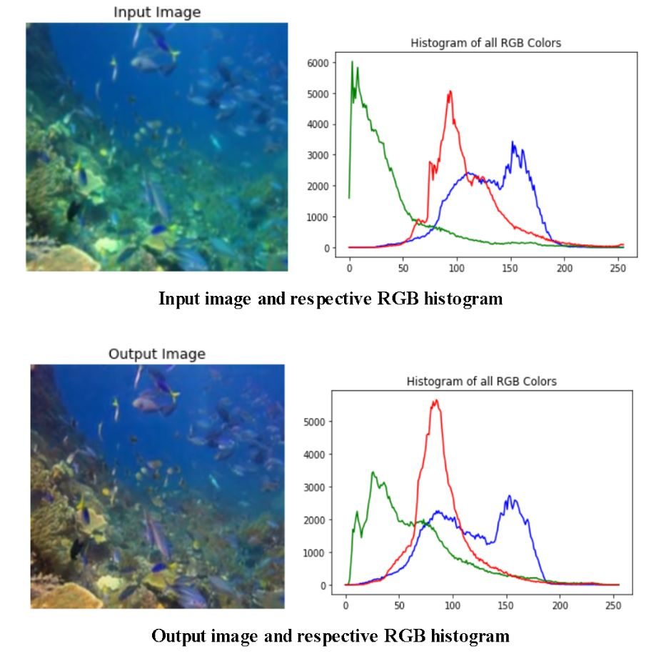

# AutoR-Encoder-DeepSea-Image-Enhancement
Enhances underwater images using a model built based on auto encoder architecture. The model was trained on a set of 2000 pairs of clear and disturbed images taken underwater. Several other methods such as BPDFHE, CLAHE, MSRCR were implemented for a comparative analysis. The quantitative analysis wereperformed and presented through values succh as PSNR, SSIM and MSE scores. The model is strictly designed for shallow waters as deeper waters would cause extreme lack of light and therefore images would be virtually colourless.

Dataset: https://drive.google.com/drive/folders/1ZEql33CajGfHHzPe1vFxUFCMcP0YbZb3?usp=sharing

<h2>Architecture</h2>

 

<h2>Output</h2>

   
   
   
   
   
   

<h2>Histogram Analysis</h2>
A sample of input out pairs were analyzed using histograms of each color channel. Enhancement of Red and green color were observed and a suppression of blue color was seen.

   

<h2>Comparative Study</h2>
The model was compared with many other algorithms and theri results. The quatitative analysis was done on 3 major metrics PSNR, SSIM and MSE. Promising results were obtained.
<h3>PSNR VALUES</h3>
The PSNR values provide Peak to Signal Ratio which is an indication of amount of noise in the iamge.

   

<h3>SSIM VALUES</h3>
This score defines the similarity between the structural features between the predicted and ideal image.

   

<h3>MSE VALUES</h3>
The MSE value is a basic error calculation method. In our case it is sum of squares of differences between each pixel pairs of predicted and ideal image.

   

